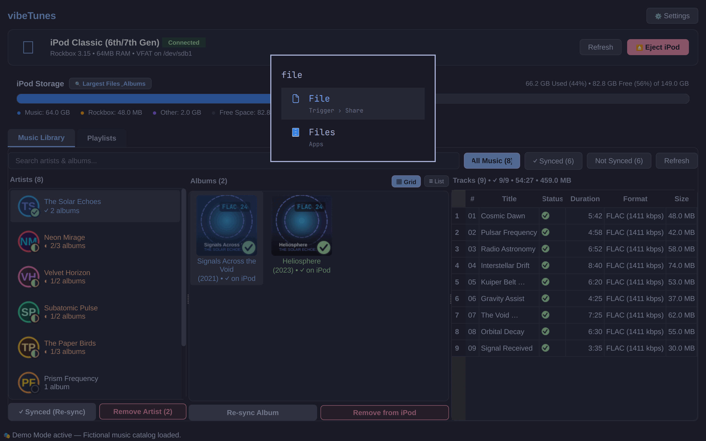

# vibeTunes

**The modern iTunes alternative for syncing lossless FLACs from Plex to your Rockbox iPod.**

vibeTunes bridges the gap between modern self-hosted music streaming on Plex Media Server and the gold standard of offline portable audio: an Apple iPod running Rockbox open-source firmware. Managing a Rockbox-modded iPod no longer requires manual file copying, dealing with fragile FAT32 file naming limits, or converting playlist path formats.

*Note: This application was proudly built with the assistance of Google Gemini.*

<p align="center">
  
</p>

---

## Key Features

* **Unified Source of Truth:** Your Plex catalog acts as your complete library while seamlessly overlaying on-device iPod transfer status with high-DPI visual status badges (synced, partial, queued, syncing, not synced, or Plex 404 missing).
* **Plex Exact File & Folder Sync:** Keeps iPod directory layouts and filenames aligned with your Plex server conventions while respecting FAT32 limits and multi-volume release distinctions.
* **Background Sync Queue:** Queue up multiple albums, artists, or playlists concurrently while a transfer is in progress without blocking the UI or requiring confirmation modals.
* **Streamlined Two-Tab Architecture:** Clean 3-pane Music Library (Artists | Albums in Grid or List view | Tracks) and 2-pane Playlists view with unified refresh and auto-sync.
* **Storage Capacity Analyzer:** Visually inspect your device's capacity hogs by ranking the largest albums, audio files, and artists.
* **Rockbox Playlist Sync:** Intelligently maps local paths to Rockbox internal drive paths and generates native `.m3u8` playlists with automatic broken path repair.
* **Plex Server Health & 404 Detection:** Automatically flags audio tracks missing on the Plex server host (HTTP 404) with clear warning badges and prevents failed sync attempts.
* **Visual Album Artwork:** Extracts embedded cover art and places `cover.jpg` in album folders to enable the Rockbox While Playing Screen (WPS).
* **Safe Eject Protocol:** Synchronously flushes all pending kernel write buffers and cleanly unmounts to protect your partition table from corruption.

---

## Installation

vibeTunes is a Linux desktop application built with PySide6 (Qt6) and Python 3.10+. Run it quickly using `uv`:

```bash
git clone https://github.com/orviwan/vibeTunes.git
cd vibeTunes
uv run vibetunes
```

### CLI Flags

```bash
# Launch in Demo Mode with a fictional music catalog & simulated iPod
uv run vibetunes --demo

# Launch in Fullscreen Mode (toggle anytime with F11 or Esc)
uv run vibetunes --fullscreen

# Combine flags
uv run vibetunes --demo --fullscreen
```

### Desktop Launcher Integration

To add vibeTunes to your system application menu (KDE Plasma, GNOME Dash, Rofi, etc.):

```bash
cp vibetunes/assets/vibetunes.svg ~/.local/share/icons/hicolor/scalable/apps/vibetunes.svg
cp vibetunes.desktop ~/.local/share/applications/vibetunes.desktop
update-desktop-database ~/.local/share/applications/
```

---

## Quick Start Guide

1. **Connect Plex:** Click Settings and use 1-Click OAuth to authorize your server.
2. **Plug In:** Connect your iPod via USB so the app can auto-detect your hardware model and storage.
3. **Sync Data:** Select an album, artist, or playlist in the library view and click **+ Add to iPod** to start background transfers.
4. **Disconnect Safely:** Always click **⏏ Eject iPod** to safely flush buffers and unmount before unplugging.

---

## Demo Mode

Want to test vibeTunes or take clean screenshots without connecting real music libraries or hardware?

Run vibeTunes in demo mode:

```bash
uv run vibetunes --demo
```

This populates vibeTunes with fictional artists, albums, procedural cover artwork, playlists, and a simulated iPod device. You can also pass `--fullscreen` or `--maximized`.
